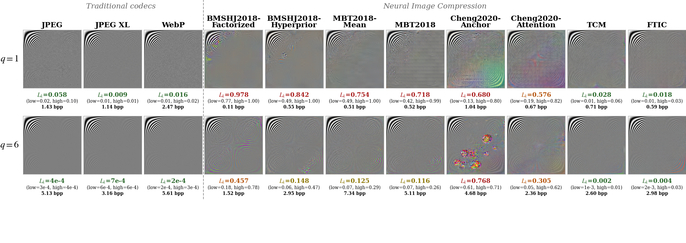
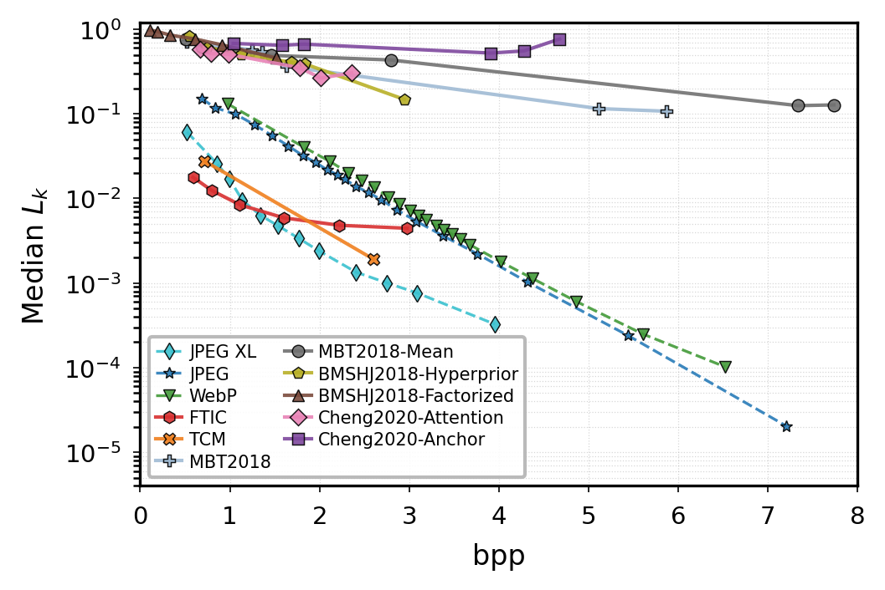
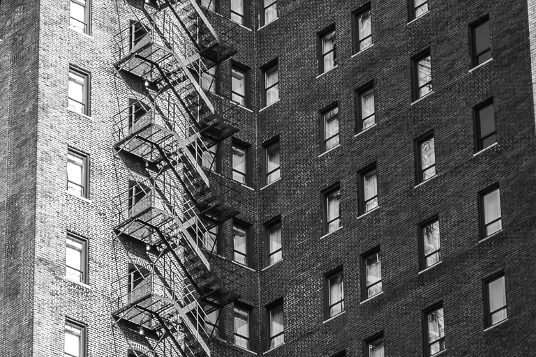
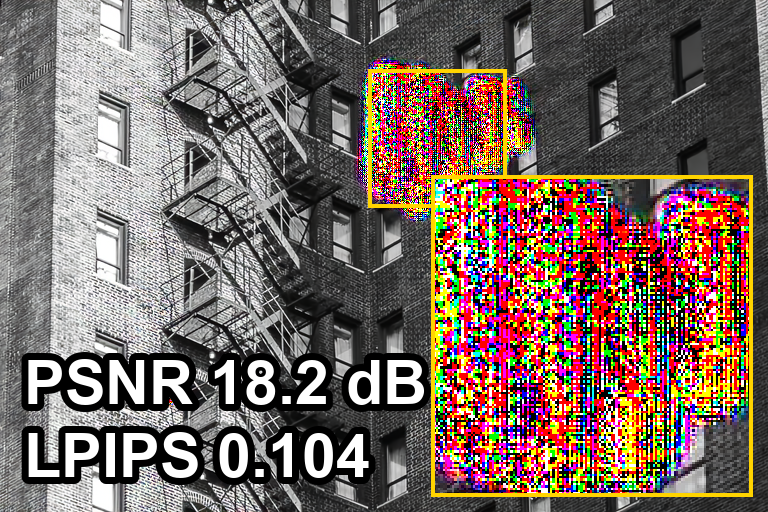
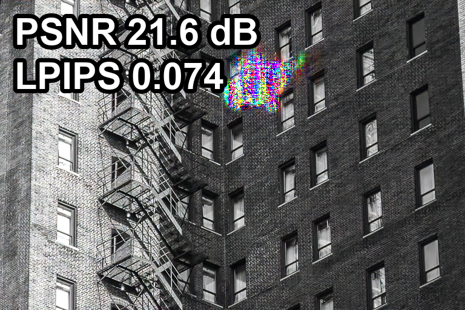
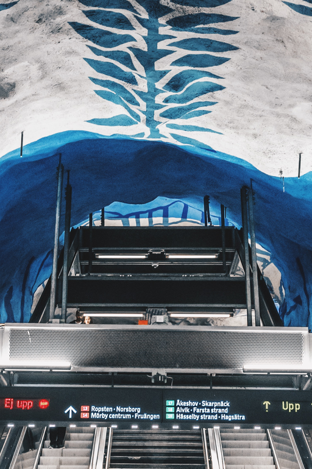
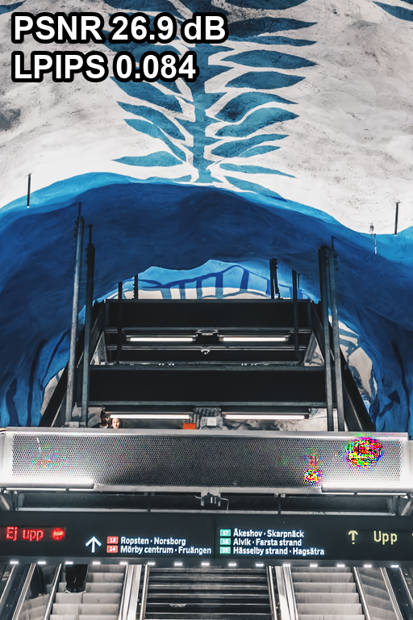
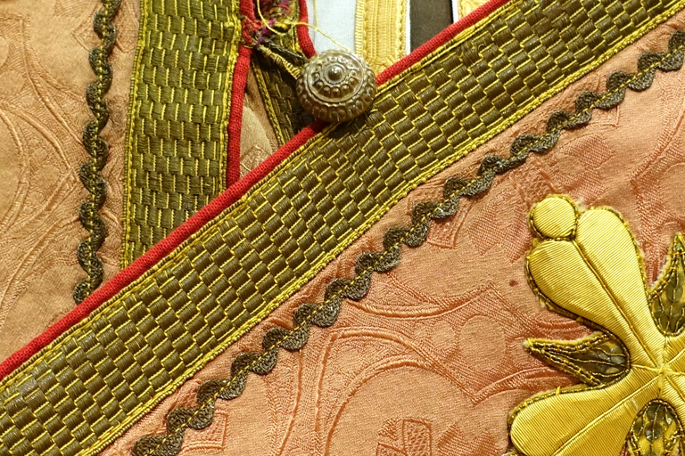
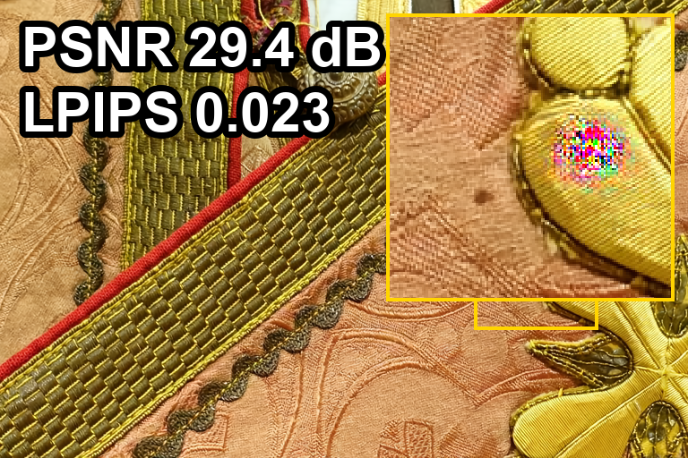
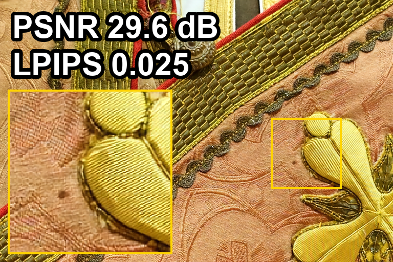

# DCT Basis Benchmarks for Neural Image Compression

[](https://www.python.org/)

> **DCT Basis Benchmarks for Neural Image Compression**  
> Kalmykov N.I., Varetsa M.S., Dibo R., Liu Y., Oseledets I., Phan A.-H.  

---

## What this benchmark does

Standard metrics (PSNR, MS-SSIM) summarize **overall** reconstruction quality but hide *which frequency components* a codec distorts. By compressing an $n \times n$ DCT basis matrix, where each spatial position encodes a unique frequency pair, we obtain a **per-frequency leakage profile** that exposes systematic biases invisible to pixel-level metrics.

<p align="center">
  <a href="paper/figures/fig3_dct_response_grid.png">
    
  </a>
</p>

<p align="center"><em>DCT-basis response for the 11 codecs at their native quality settings (two levels each), hence at different bitrates — shown only to illustrate which per-frequency artifacts each codec introduces. The paper uses a matched-bitrate version (≈1.0 bpp) for a fair side-by-side comparison.</em></p>

**Key finding:** Neural image codecs suppress up to **94% of their distortion** in high-frequency bands, while classical codecs (JPEG, JPEG XL, WebP) remain spectrally uniform.

<p align="center">
  
</p>

<p align="center">
  <em>Rate–leakage comparison at 256×256. Traditional codecs (dashed) achieve orders-of-magnitude lower leakage across all bitrates. TCM and FTIC approach classical levels.</em>
</p>

---

## Pipeline

```
DCT basis  D = DCT(Iₙ)
     │
     ▼  [Codec: encode → decode]
     │
Reconstruction  D̂
     │
     ▼  [DCT domain analysis]
     │
Response matrix  R[i,k] = |DCT(D̂[:,k])ᵢ|² / Σⱼ|DCT(D̂[:,k])ⱼ|²
     │
     ▼
Metrics per frequency k:
  L_k  = 1 − R[k,k]          Leakage       ↓ better
  ODR_k = tanh(Σᵢ≠ₖ R[i,k] / 2R[k,k])  Off-diag ratio ↓ better
  |Δ_k|  = |centroid(k) − k| / norm     Centroid shift ↓ better
  σ_k    = spread of response column k  Spread         ↓ better
  H_k    = entropy of R[:,k]            Entropy        ↓ better
```

---

## Installation

```bash
git clone https://github.com/nkalmykovsk/dct_benchmark_nic.git
cd dct_benchmark_nic

python3 -m venv env && source env/bin/activate
pip install -r requirements.txt
pip install -e .          # install dct_nic as editable package
```

**Requirements:** Python ≥ 3.10, PyTorch ≥ 2.0, CUDA GPU (recommended).

### Optional: JPEG XL support

```bash
pip install imagecodecs
```

### Third-party models: TCM and FTIC

TCM and FTIC require cloning their official repositories into `third_party/`:

```bash
# TCM (Liu et al., 2023)
git clone https://github.com/jmliu206/LIC_TCM.git third_party/LIC_TCM
# Download checkpoints via gdown (auto-handled by dct_nic.loaders):
#   mse_lambda_0.0025.pth.tar  (p=64)
#   mse_lambda_0.05.pth.tar    (p=128)

# FTIC (Xu et al., ICLR 2024)
git clone https://github.com/xyq7/ICLR2024-FTIC.git third_party/ICLR2024-FTIC
# Download checkpoints into third_party/ICLR2024-FTIC/checkpoints/
#   ckpt_mse_0018.pth ... ckpt_mse_0483.pth
```

> **Note:** If you only need CompressAI models and classical codecs, third_party setup is optional.

---

## Quick Start

### Evaluate any codec in 3 lines

```python
from dct_nic import evaluate_codec, load_model

model = load_model("cheng2020-anchor", quality=4, device="cuda")
result = evaluate_codec(model, size=256, device="cuda", model_name="cheng2020-anchor")

print(f"Median leakage L_k = {result['L_k']:.4f}")   # lower is better
print(f"Bitrate            = {result['bpp']:.3f} bpp")
```

### Evaluate your own NIC model

Any callable `f(x) → {"x_hat": tensor}` works:

```python
from dct_nic import evaluate_codec

class MyNIC:
    def __call__(self, x):          # x: [1, 3, H, W] tensor in [0, 1]
        x_hat = my_encode_decode(x) # your codec here
        return {"x_hat": x_hat}

result = evaluate_codec(MyNIC(), size=256, device="cuda")
print(f"L_k={result['L_k']:.4f}  ODR={result['ODR_k']:.4f}  H={result['H_k']:.4f}")
```

### Interactive exploration

```bash
jupyter notebook notebooks/01_demo.ipynb
```

---

## Reproducing Paper Results

### Run the full benchmark (generates all CSVs)

```bash
# Single quality (q=6), DCT size 256
python scripts/run_benchmark.py --size 256

# Rate–leakage sweep (all quality levels) — generates Fig. 5 data
python scripts/run_benchmark.py --size 256 --quality-sweep

# All sizes from the paper
python scripts/run_benchmark.py --size 64 128 256 512 1024 --quality-sweep
```

### Directional leakage (Fig. S1)

```bash
# Matched bitrate ≈ 2.5 bpp, 512×512 (paper settings)
python scripts/run_directional.py --size 512 --matched-bpp
```

### 2-D DCT basis: frequency-response tensor

In the main experiments, the response **matrix** is built from the 1-D DCT basis (each
column is one 1-D cosine). A separable **2-D** basis — a mosaic of `s²` tiles, one per
frequency pair `(k,l)` — generalizes this to a frequency-response **tensor** with leakage
**map** `L_{k,l}`:

```bash
# All 11 codecs at highest quality (mosaic 256×256; --tile-n 32 for 1024×1024)
python scripts/run_2d_leakage.py --tile-n 16 --q 6 --device cuda
```

**Using a 2-D basis does not change the conclusions.** The 2-D map ranks codecs
identically to the 1-D profile (Spearman `0.95`), and `L_k` is the `l=0` slice of
`L_{k,l}` (verified on classical codecs, gap `< 0.002`). The same high-frequency-
suppression pattern holds (e.g. BMSHJ2018-Factorized high-band leakage `≈ 1.0`, classical
codecs `≈ 1e-4`). Results are saved to `results/leakage_2d/`.

### Fine-tuning experiment (Fig. 2c / Fig. S3)

```bash
# 128×128 (Fig. 2c)
python scripts/run_finetune.py --model cheng2020-anchor --size 128 --steps 900

# 1024×1024 (Fig. S3, ~5 min on A100)
python scripts/run_finetune.py --model cheng2020-anchor --size 1024 --steps 900
```

### Natural-image reconstruction after fine-tuning

Joint decoder-only fine-tuning with `L = MSE(natural patches) + λ · L_leak(DCT basis)`.
The encoder, hyperprior and entropy model stay frozen, so the **bitrate is unchanged by
construction**; only the decoder `g_s` is updated.

```bash
# DIV2K patches for the MSE anchor; the 3 figure images are auto-excluded from training
python scripts/run_finetune_natural.py --train-dir data/div2k --device cuda
```

At fixed bpp this recovers high-frequency detail and attenuates the compression artifacts
shown above. Outputs go to `results/finetune_natural_heldout/`.

### Table I: Kodak evaluation with spectral leakage coupling

```bash
# Download Kodak images first (24 images, 768×512 / 512×768)
mkdir -p data/kodak
# ... download from http://r0k.us/graphics/kodak/

# Run evaluation (requires GPU, ~1h for all models)
python scripts/run_kodak_eval.py --kodak-dir data/kodak

# Quick test (1 model, 1 image)
python scripts/run_kodak_eval.py --kodak-dir data/kodak --single
```

### Generate all paper figures

```bash
jupyter nbconvert --to notebook --execute notebooks/02_paper_figures.ipynb
```

---

## Compression artifacts on natural images

<p align="center">
<table>
<tr>
  <td align="center"><b>Original</b></td>
  <td align="center"><b>Cheng2020-Anchor (q=6)</b></td>
  <td align="center"><b>+ Leakage fine-tuning</b></td>
</tr>
<tr>
  <td></td>
  <td></td>
  <td></td>
</tr>
<tr>
  <td></td>
  <td></td>
  <td></td>
</tr>
<tr>
  <td></td>
  <td></td>
  <td></td>
</tr>
</table>
</p>
<p align="center"><em>Decoder-only leakage fine-tuning attenuates compression artifacts at <strong>identical bitrate</strong> (PSNR/LPIPS overlaid). Fine-tuned on <strong>DIV2K only</strong>; all three images held out (bottom row is cross-dataset CLIC). For the near-lossless bottom row the +0.002 LPIPS change is measurement noise near zero — PSNR rises and the artifact is removed. See <code>scripts/run_finetune_natural.py</code>.</em></p>

## Codec Configurations

| Codec | Quality sweep |
|-------|--------------|
| CompressAI (6 models) | q ∈ {1, 2, 3, 4, 5, 6} |
| FTIC | q ∈ {1, 2, 3, 4, 5, 6} (n ≥ 256 only) |
| TCM | λ ∈ {0.0025, 0.05}, p=64, 128 (n ≥ 256 only) |
| JPEG / WebP | quality ∈ {20, 40, 55, 70, 85, 95} |
| JPEG XL | distance ∈ {4.0, 2.0, 1.0, 0.6, 0.3, 0.1} |

Table I uses ≈0.8–1.0 bpp, DCT size 512×512, 24 Kodak images.

---

## Project Structure

```
dct_benchmark_nic/
├── dct_nic/               # Installable Python package
│   ├── __init__.py        # Public API
│   ├── metrics.py         # L_k, ODR, centroid_shift, spread, entropy
│   ├── evaluate.py        # evaluate_codec(), run_benchmark()
│   └── loaders.py         # Model loaders (CompressAI, TCM, FTIC, classical)
├── scripts/
│   ├── run_benchmark.py       # Full benchmark → results/leakage_vs_bpp/
│   ├── run_kodak_eval.py      # Table I: Kodak + L̃ coupling → results/kodak_eval/
│   ├── run_directional.py     # Directional leakage → results/directional/
│   ├── run_finetune.py        # Fine-tuning demo → results/finetune/
│   ├── plot_fig3_grid.py      # Fig. 3: DCT response grid (11 codecs × 2 quality)
│   ├── plot_fig4b_artifact.py # Fig. 4b: 1024×1024 reconstruction artifact
│   └── plot_distortion_consistency.py  # Fig. S2: L̃ consistency
├── notebooks/
│   ├── 01_demo.ipynb      # Interactive demo and exploration
│   └── 02_paper_figures.ipynb  # Reproduce all paper figures
├── results/               # Pre-computed CSVs
│   ├── all_metrics_summary.csv  # Full benchmark: all codecs × sizes × q
│   ├── leakage_vs_bpp/    # Rate–leakage scan data per size
│   ├── directional/       # Directional leakage data
│   ├── kodak_eval/        # Table I: Kodak spectral coupling + perceptual metrics
│   └── finetune/          # Fine-tuning results
├── paper/figures/         # Final paper figures (PDF)
├── third_party/
│   ├── LIC_TCM/           # TCM model code + checkpoints
│   └── ICLR2024-FTIC/     # FTIC model code
└── requirements.txt
```

---

## Evaluated Codecs

| Model | Type | Params |
|-------|------|--------|
| BMSHJ2018-Factorized | NIC | CompressAI q=1–6 |
| BMSHJ2018-Hyperprior | NIC | CompressAI q=1–6 |
| MBT2018-Mean | NIC | CompressAI q=1–6 |
| MBT2018 | NIC | CompressAI q=1–6 |
| Cheng2020-Anchor | NIC | CompressAI q=1–6 |
| Cheng2020-Attention | NIC | CompressAI q=1–6 |
| TCM | NIC | λ∈{0.0025,0.05}, p=64,128 |
| FTIC | NIC | q=1–6 (n≥256) |
| JPEG | Classical | quality 20–95 |
| JPEG XL | Classical | distance 0.1–4.0 |
| WebP | Classical | quality 20–95 |

---

## Citation

```bibtex
@article{kalmykov2026dct,
  title={DCT Basis Benchmarks for Neural Image Compression},
  author={Kalmykov, Nikolay I. and Varetsa, Maria S. and Dibo, Razan and Liu, Yipeng and Oseledets, Ivan and Phan, Anh-Huy},
  journal={},
  year={},
  publisher={}
}
```

---

## Acknowledgments

- [CompressAI](https://github.com/InterDigitalInc/CompressAI) — neural codec implementations
- [LIC_TCM](https://github.com/jmliu206/LIC_TCM) — TCM model
- [ICLR2024-FTIC](https://github.com/xyq7/ICLR2024-FTIC) — FTIC model
- Kodak dataset — [USC SIPI](http://sipi.usc.edu/database/database.php?volume=misc)
