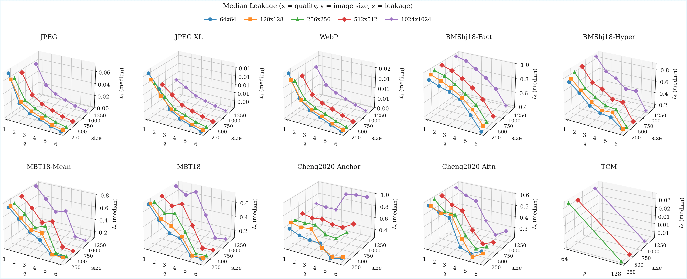

# DCT Basis Benchmarks for Neural Image Compression: Revealing Frequency Dependent Biases


<p align="center">
  
</p>

<p align="center">
  <em>3D overview of median frequency leakage (L<sub>k</sub>) for 10 codecs. Each panel: x = quality, y = image size, z = median L<sub>k</sub> (↓ better). Values are medians across frequency bins, averaged over 100 runs.</em>
</p>

---

## Overview

This repository provides a systematic benchmark for evaluating **frequency response characteristics** of image compression codecs using DCT (Discrete Cosine Transform) basis functions as test signals.

**Key Contributions:**
- Novel frequency-domain evaluation framework using DCT basis images
- Comprehensive analysis of 10 codecs: 3 traditional (JPEG, JPEG XL, WebP) and 7 neural (BMShj18-Factorized, BMShj18-Hyperprior, MBT18-Mean, MBT18, Cheng2020-Anchor, Cheng2020-Attn, TCM)
- Six frequency-specific metrics revealing codec biases
- Adaptive fine-tuning method to reduce frequency leakage

---

## Evaluated Metrics

We propose six metrics computed from the response matrix **R** obtained by compressing DCT basis images:

| Metric | Symbol | Description | Optimal |
|--------|--------|-------------|---------|
| **Frequency Leakage** | L<sub>k</sub> | Energy leaking to off-diagonal elements: L<sub>k</sub> = 1 − diag(R)<sub>k</sub> | ↓ lower |
| **Off-Diagonal Ratio** | ODR<sub>k</sub> | Ratio of off-diagonal to diagonal response | ↓ lower |
| **Centroid Shift** | \|Δc<sub>k</sub>\| | Displacement of energy centroid from diagonal position | ↓ lower |
| **Spread** | s<sub>k</sub> | Spatial spread of response around the diagonal | ↓ lower |
| **Entropy** | H<sub>k</sub> | Shannon entropy of the normalized response distribution (bits) | ↓ lower |
| **Concentration Energy** | CE<sub>k</sub>(w) | Energy ratio within window w around diagonal | ↑ higher |

---

## Installation

```bash
git clone https://github.com/nkalmykovsk/dct_benchmark_nic.git
cd dct_benchmark_nic
python3 -m venv env && source env/bin/activate
pip install -r requirements.txt
```

**Requirements:** Python ≥ 3.10, PyTorch ≥ 2.0, CUDA-capable GPU (recommended)

---

## Usage

### Run Full Benchmark

```bash
jupyter notebook demo.ipynb
```

The notebook executes experiments across:
- **Models:** JPEG, JPEG XL, WebP, BMShj18-Factorized, BMShj18-Hyperprior, MBT18-Mean, MBT18, Cheng2020-Anchor, Cheng2020-Attn, TCM
- **Quality levels:** q ∈ {1, 2, 3, 4, 5, 6} (p ∈ {64, 128} for TCM)
- **Image sizes:** 64×64, 128×128, 256×256, 512×512, 1024×1024

### Generate Figures

```bash
python utils/generate_figures.py --root results/
```

---

## Project Structure

```
dct_benchmark_nic/
├── demo.ipynb              # Main experiment notebook
├── utils/
│   ├── functions.py        # Core metrics and evaluation functions
│   ├── loaders.py          # Model loading utilities
│   ├── generate_figures.py # Paper figure generation
│   └── tcm_setup.py        # TCM model setup
├── results/                # Experiment outputs (metrics, images)
├── images/                 # Figures for README
└── requirements.txt
```

---

## Results Summary

| Model | Type | Median L<sub>k</sub> (q=1, 512×512) |
|-------|------|-------------------------------------|
| TCM | Neural | **0.002** |
| JPEG | Traditional | 0.058 |
| JPEG XL | Traditional | 0.089 |
| WebP | Traditional | 0.124 |
| Cheng2020-Attn | Neural | 0.576 |
| Cheng2020-Anchor | Neural | 0.680 |
| MBT18 | Neural | 0.812 |
| MBT18-Mean | Neural | 0.845 |
| BMShj18-Hyperprior | Neural | 0.923 |
| BMShj18-Factorized | Neural | 0.978 |

---

## Citation

```bibtex
@inproceedings{kalmykov2025dct,
  title={DCT Basis Benchmarks for Neural Image Compression: Revealing Frequency-Dependent Biases},
  author={Kalmykov, Nikita},
  booktitle={Proceedings of [Conference Name]},
  year={2025}
}
```

---

## License

This project is released under the MIT License.

## Acknowledgments

- [CompressAI](https://github.com/InterDigitalInc/CompressAI) for neural codec implementations
- [LIC_TCM](https://github.com/jmliu206/LIC_TCM) for the TCM model
